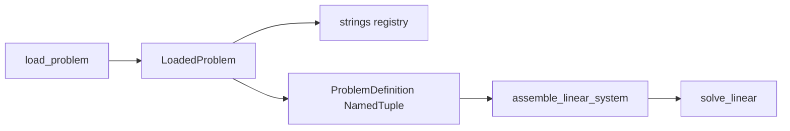

# v3 architecture

## Data flow

## `ProblemDefinition` (NamedTuple)

Array-only bundle for assembly and future `@njit` kernels:

| Field | Type | Role |
|-------|------|------|
| `coords` | `F64` (N, dim) | Node coordinates |
| `conn` | `I32` (E, nodes) | Element connectivity |
| `global_dofs` | `I32` (n_dof,) | Global DOF numbering |
| `constitutive` | `F64` (3, 3) | Plane-stress D matrix |
| `constraint_dof` | `I32` | Prescribed DOF indices |
| `constraint_val` | `F64` | Prescribed values |
| `external_load` | `F64` (n_dof,) | Nodal force vector (`fhat`) |

Properties: `n_nodes`, `n_elems`, `n_dofs`.

Built by `pack_problem()` from load-time `Mesh` / `DofMap`. No jitclass layer — pass the NamedTuple or unpacked arrays to Numba when needed.

## `LoadedProblem` (dataclass)

Holds `problem: ProblemDefinition` plus metadata (`element_type`, `material_type`, `mesh_path`, etc.) for registry dispatch. Strings and paths stay out of the jitable bundle.

## FEM stack

Legacy `SmallStrainContinuum` maps to one v3 continuum kernel; **element family is inferred from `conn.shape[1]`** (3 / 4 / 8 nodes).

| Family | Shapes | Quadrature (literal) | DOFs/elem |
|--------|--------|----------------------|-----------|
| Q8 | `serendipity_quad8` | `gauss_tensor_product_2d(3)` | 16 |
| Quad4 | `bilinear_quad4` | `gauss_tensor_product_2d(2)` | 8 |
| Tria3 | `linear_tria3` | `gauss_tria3(1)` | 6 |

1. **Quadrature** — `@njit` Gauss–Legendre on `[-1,1]` (`@overload` + `literally(order)`); 2D quads via `_meshgrid_2d`; Tria3 via tabulated order-1 rule.
2. **Shapes** — `@njit` reference-element `N`, `∂N/∂ξ` per family.
3. **Kinematics** — serial `@njit` `∂N/∂x` and `|J|` via 2×2 `@` / `linalg` on each Gauss point (shared across families).
4. **Element** — Q8: fused ``@njit`` loop (``J``, ``B``, quadrature in one ``prange``); Quad4/Tria3: staged kinematics + integration ``prange``.
5. **Assembly** — dispatch stiffness by nodes/elem; chunked COO scatter when ``n_elems > 2048``; generic serial ``@njit`` COO fill.

## Solver

- Global system: SciPy `coo_array` + `spsolve`.
- BCs: native prescribed displacements and MPC ties (`solver/constraints.py`).
- Repeated solves: experimental `LinearSolutionContext` in `solver/context.py` (`prepare_linear_solve`).

## Scale

See [scaling.md](scaling.md). Uniform Q8 patch meshes: `pyfem/v3/mesh/refined_patch.py`.

## Skims

See [parity.md](parity.md). Layer C is always `ProblemDefinition`.
