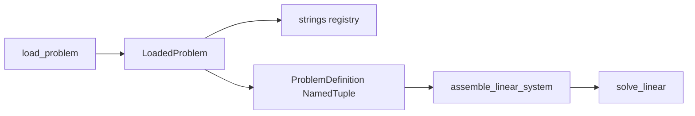

# v3 architecture

## Data flow

## `ProblemDefinition` (NamedTuple)

Array-only bundle for assembly and future `@njit` kernels:

| Field | Type | Role |
|-------|------|------|
| `coords` | `F64` (N, dim) | Node coordinates |
| `conn` | `I32` (E, nodes) | Element connectivity |
| `global_dofs` | `I32` (n_dof,) | Global DOF numbering |
| `constitutive` | `F64` (3, 3) | Plane-stress D matrix |
| `constraint_dof` | `I32` | Prescribed DOF indices |
| `constraint_val` | `F64` | Prescribed values |

Properties: `n_nodes`, `n_elems`, `n_dofs`.

Built by `pack_problem()` from load-time `Mesh` / `DofMap`. No jitclass layer — pass the NamedTuple or unpacked arrays to Numba when needed.

## `LoadedProblem` (dataclass)

Holds `problem: ProblemDefinition` plus metadata (`element_type`, `material_type`, `mesh_path`, etc.) for registry dispatch. Strings and paths stay out of the jitable bundle.

## FEM stack

1. **Quadrature** — `@njit` Gauss–Legendre (`@overload` + compile-time literal `order`); 2D rule composes 1D with `_meshgrid_2d` (loop tensor product, no `meshgrid`).
2. **Shapes** — `@njit` Serendipity Q8 `N`, `∂N/∂ξ`.
3. **Kinematics** — serial `@njit` `∂N/∂x` and `|J|` via 2×2 `@` / `linalg` on each Gauss point.
4. **Element** — `@njit` staged `B` then semantic `(elem×gp)` quadrature of `w |J| Bᵀ C B`; **`prange` over elements** (sole parallel region); Python wrapper adds a leading axis for one element.
5. **Assembly** — serial `@njit` COO scatter after batched element stiffness.

## Solver

- Global system: SciPy `coo_array` + `spsolve`.
- BCs: native prescribed displacements (`solver/constraints.py`); MPC/ties deferred.

## Skims

See [parity.md](parity.md). Layer C is always `ProblemDefinition`.
