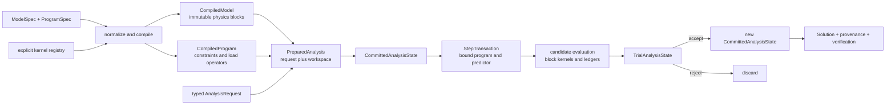

# PyFEM v3 ground-up design

- Status: **authoritative for new v3 work**
- Decision date: 2026-07-17
- Scope: architecture, invariants, proof strategy, and migration order

This document resets the v3 design from first principles. The code already under
`pyfem/v3/`, its tests, benchmarks, and the other documents in this directory are
evidence, not constraints. In particular, the existing `ProblemDefinition`,
`LoadedProblem`, shape-based dispatch, feature-parity roadmap, and public functions
may be replaced without compatibility shims.

The packaging and tooling modernization on this branch remains the platform
baseline. It is independent of the library architecture described here.

## 1. North star

PyFEM v3 is a finite-element library in which:

1. a convenient authored model is compiled once into validated, immutable,
   array-backed data;
2. numerical work runs over homogeneous blocks with explicit kernel bindings;
3. every changing quantity belongs to an explicit state with a defined lifetime;
4. nonlinear trial state can be discarded or committed without hidden mutation;
5. topology, constraints, and sparse assembly structure are prepared once and
   reused;
6. solvers request mathematical contributions rather than knowing element or
   material classes; and
7. a solution retains enough provenance and balance information to audit whether
   it is a valid answer to the compiled problem.

The goal is not “put every value in one tuple” or “remove every object.” In this
project, **data-oriented** means partitioning data by semantic owner, shape, and
lifetime; storing hot data contiguously; making state transitions explicit; and
dispatching outside inner loops.

Correctness comes first, representative end-to-end performance second, and local
code cleverness third.

## 2. Authority and non-goals

### 2.1 Authority order

When sources disagree, use this order:

1. the overall goal above and the invariants in this document;
2. executable edge-case tests written for the new design;
3. the new implementation;
4. legacy PyFEM as a requirements and numerical-reference source;
5. the current v3 prototype as a source of reusable kernels and lessons;
6. historical v3 plans, benchmark thresholds, and compatibility claims.

Changing an invariant requires a recorded design change and a testable reason.
An old API, benchmark, or completed roadmap checkbox is not a reason by itself.

### 2.2 Deliberate non-goals

- Preserving the current v3 internal or public API.
- Porting the legacy object graph class by class.
- Reaching legacy feature parity before the core state model is sound.
- Making an entire problem directly consumable by one Numba function.
- Using Numba, parallel loops, or fused kernels without measured benefit.
- Keeping one rectangular connectivity table for every element.
- Encoding solver choice, formulation, or material behavior in global strings.
- Assuming every operator is affine, symmetric, positive definite, or even
  assembled as a matrix.
- Solving GUI or complete legacy-input compatibility during the core rewrite.
- Making the compiler output editable after validation.

Legacy input support will be an adapter into the authored schema. It must not
define the core representation.

## 3. Evidence behind the reset

### 3.1 What the current v3 proved

The prototype established useful facts:

- NumPy/SciPy plus small Numba kernels can reproduce selected legacy linear,
  finite-strain, structural, and Riks skims.
- The quadrature, shape-function, kinematic, constraint-reduction, and safe
  literal-parsing work contains reusable pieces.
- Homogeneous batched element evaluation is a productive performance unit.
- COO assembly, factorization reuse, and scale fixtures give us reference
  implementations and benchmark scaffolding.
- A clean I/O shell around numeric kernels is easier to reason about than the
  legacy runtime object graph.

These are component-level results. They do not validate the current whole-problem
representation.

### 3.2 What the current v3 does not prove

The branch history expanded rapidly from one homogeneous Q8 linear problem into
nonlinear, multi-group, structural, and Riks paths. Several performance policies
were also reversed over short sequences of commits. That is normal prototype
evidence, but it is not a stable architecture.

The commit sequence makes the distinction concrete. `ea7bc30` combined useful
packaging modernization with the first v3 carrier. Four performance commits
(`7804ef8` through `fd103f0`) changed parallelization, Jacobian retention, scatter,
and thresholds before the domain/state model existed. `8967aae` then fixed a
feature-checklist workflow, while `44285fa` and `e4c5014` added nonlinear,
finite-strain, Riks, structural, parser, benchmark, and group behavior in very broad
changes. The resulting roadmap even marks beam breadth complete though the
prototype implements truss/spring but no beam. Commit history therefore preserves
valuable experiments; it does not ratify the first carrier.

Direct probes found these counterexamples:

| Counterexample | Current behavior | Architectural cause |
|---|---|---|
| Two nodal loads target one DOF | the later value replaces the earlier one | load packing assigns instead of accumulating |
| A packed model is mutated after validation | coordinate and connectivity arrays remain writeable | a frozen tuple does not freeze contained arrays |
| A continuum group is passed through the group path | the global constitutive matrix becomes zero | one group encoding is shared by incompatible physics |
| An element has an unmapped group ID | assembly returns an empty-looking stiffness instead of failing | group membership is filtered at runtime without a totality check |
| Continuum arrays are wrapped in Truss/Spring/Riks strings and sent to the linear solver | the same continuum solution is returned | registries validate vocabulary, not model/analysis compatibility |
| A nonlinear step has an affine MPC slave | prescribed-state handling overwrites the slave relation | constraints are arrays to patch, not one canonical affine map |
| MPC declarations contain a cycle | chain flattening can continue indefinitely | graph validity is attempted by iterative substitution rather than compilation |
| A clockwise Q4 has negative Jacobians | stiffness is produced using `abs(det J)` | geometry invalidity is hidden inside integration |
| Newton is forced to fail | the caller-owned candidate vector has already been modified | candidate and caller state alias, with no transaction boundary |
| A nonlinear step converges | the reported step increment is reset to zero | evolution/result state has no authoritative owner |
| Riks has nonzero prescribed offsets | the offsets are not applied | solver-specific paths reconstruct constraint semantics independently |

The relevant implementation is in `pyfem/v3/types.py`, `pack.py`,
`solver/nonlinear.py`, and `fem/element.py`. These failures are not isolated bugs;
they expose missing ownership and invariant boundaries.

Other structural limits include:

- `ProblemDefinition.conn` is rectangular, so a model cannot naturally contain
  mixed topologies or local DOF layouts.
- formulation is inferred from spatial dimension and node count;
- one constitutive matrix is global, while `group_props` has one fixed ad hoc
  width;
- solver, material, and formulation metadata are split between mutable wrapper
  strings and numeric arrays;
- local integration-point history has no representation;
- `SolverState` cannot distinguish accepted, candidate, and scratch data;
- assembly rebuilds triplets even when topology is unchanged; and
- result objects do not carry equilibrium, reactions, state provenance, or an
  independent verification contract.

### 3.3 Requirements extracted from legacy PyFEM

Legacy PyFEM is not a design template, but its breadth exposes real requirements:

- mixed element topologies, regions, sections, and material assignments;
- arbitrary named fields and local DOF layouts, including mechanical, thermal,
  phase-field, and coupled elements;
- volume, boundary, interface, structural, inertial, damping, and constraint
  contributions;
- material history per integration point, with trial values and commit after an
  accepted step;
- small- and finite-strain kinematics, geometric tangents, and path-dependent
  constitutive response;
- linear, Newton, path-following, transient, explicit, eigen, staggered, and
  reduced-order analyses;
- reactions, internal/external force ledgers, energies, dissipation, and projected
  output fields; and
- multiple analyses or load cases over the same physical discretization.

The new core must make these representable without allocating a Python element or
material object per element or integration point.

### 3.4 What transfers from `absim_fvm`

The transferable pattern is:

> authored convenience data -> normalized specification -> audited compiled model
> -> bound operating/load state -> reusable operator/workspace -> verified result

The important lesson is separation by ownership and lifetime, not copying FVM
types. PyFEM additionally needs heterogeneous topology, arbitrary local field
layouts, local constitutive history, nonlinear trial/commit semantics, and several
kinds of assembled operator. Those FEM-specific needs are first-class below.

## 4. The finite-element semantics we must preserve

A finite-element analysis combines six different things that must not be collapsed
into one carrier:

1. **physical discretization** — geometry, fields, regions, formulations,
   materials, quadrature, and local-to-global maps;
2. **program** — constraints, loads, prescribed histories, time/load schedule, and
   initial conditions;
3. **accepted physical state** — primary fields and local history at the last
   accepted point;
4. **accepted analysis evolution** — program coordinates, field derivatives,
   continuation/integrator variables, and program-owned interaction history;
5. **candidate evaluation** — a proposed global/evolution state and the local trial response
   derived from the accepted state; and
6. **algorithm/workspace** — solver controls, sparse matrices, factorizations,
   temporary buffers, convergence history, and caches.

For fixed linear kinematic constraints, the canonical relation is

```text
u = P q + u_bar(p)
```

where `u` is the full field vector, `q` is the independent vector, `P` is a compiled
prolongation map, and `u_bar(p)` is the prescribed offset at structured program
coordinates `p` (time plus active named load/continuation parameters).
Consequently,

```text
r_q = P.T @ (f_ext - f_int)
K_q = P.T @ K @ P
```

All fixed Dirichlet conditions and linear MPCs use this one representation. Contact,
inequalities, and state-dependent constraints are not forced into it; they are
separate nonlinear contributions with explicit active-set state.

For path-dependent response, an evaluation is conceptually pure:

```text
(response, trial_material_state, trial_formulation_state) = evaluate(
    candidate_kinematics,
    compiled_parameters,
    committed_material_state,
    committed_formulation_state,
    bound_program_inputs,
    evaluation_request,
)
```

Repeated evaluation of the same candidate against the same committed state must
produce the same response and trial state. Rejected iterations and rejected steps
must not alter committed state. An accepted step commits exactly the trial state
associated with the accepted global candidate.

These equations and state transitions are architecture, not solver details.

## 5. Mandatory invariants

### 5.1 Compilation boundary

The compiler must:

- resolve names, IDs, units/conventions, topology, field layouts, formulation,
  material, section, and quadrature explicitly;
- validate all shapes, ranges, compatibility rules, and finite numeric inputs;
- map external labels to dense internal indices while preserving a source map;
- reject duplicate or ambiguous definitions unless composition is explicitly
  defined;
- partition work into homogeneous blocks;
- build deterministic local-to-global maps and immutable contribution-topology
  recipes from which preparation can compose a backend-specific assembly plan;
- allocate a local-state layout without allocating evolving state values;
- emit provenance including schema and kernel versions; and
- make all compiler-owned arrays read-only before returning.

Nothing downstream may infer a formulation from `shape`, node count, a file string,
or the presence of optional arrays. Invalid geometry must be diagnosed with source
entity IDs. Integration must never repair orientation with `abs(det J)`.

Reference-configuration geometry is audited during compilation. Finite-strain or
moving-geometry formulations must also validate the current mapping at every
evaluation; a valid reference Jacobian does not authorize an inverted candidate.

### 5.2 Identity and compatibility

The design uses three different identities; they are not interchangeable:

1. **Live instance identity** — every compiled model, compiled program, and
   prepared analysis has an opaque in-process `instance_id`. Caches, workspaces,
   live states, and zero-copy views require an exact instance match.
2. **Content fingerprint** — normalized semantic content, source/entity mapping,
   schema versions, numeric conventions, and the frozen kernel-registry snapshot
   produce a reproducible model/program/request fingerprint. This is the persisted
   compatibility key for checkpoint/restart and detached results.
3. **State generation identity** — every atomic accepted transition creates a new
   monotonically related generation ID. Trials and ledgers record the exact base
   and candidate generations.

Ordinary in-process composition is strict: a live state or program from compiled
instance A is rejected by instance B even when their shapes or fingerprints match.
An explicit restore/rebind operation may attach a detached checkpoint to a newly
compiled instance only after verifying content fingerprint, state/evolution schema,
kernel versions, numeric conventions, and source/entity mapping. Rebinding creates
a new live state; it never relaxes workspace identity checks.

Fingerprint canonicalization sorts declarations that are semantically unordered by
stable semantic ID and preserves order where order has physical meaning, such as a
layer stack or schedule. Thus permuting unordered authored declarations preserves
the content fingerprint, while changing a physically ordered sequence does not.

Array-owning dataclasses use identity semantics rather than generated elementwise
equality.

### 5.3 Mutability

- Authored specifications are ordinary immutable value objects where practical.
- Compiler output is structurally frozen and its arrays are read-only.
- Accepted and trial physical states are distinct owners.
- Published accepted states and solutions expose read-only snapshots; internal
  buffer swapping/copying may not let a later trial mutate an earlier snapshot.
- Solver workspaces may be mutable, but cannot contain authoritative physical
  history.
- Kernel scratch buffers belong to an evaluation/workspace and cannot leak into a
  later step as hidden state.
- A `Solution` is a snapshot; continued solving produces a new solution or an
  explicit continuation object.

### 5.4 Contributions and conservation

- Repeated compatible loads add; they never silently replace one another.
- Force/balance channels remain semantically distinct: internal, external, inertia,
  damping, constraint/contact, and any other named contribution. Tangent channels
  are attributable and requestable as material, geometric, load, constraint, and
  other terms, but an optimized kernel may emit a fused total tangent unless a
  diagnostic request asks for decomposition.
- Sign conventions are centralized and tested at the assembly boundary.
- Constraint reporting distinguishes the full nodal constraint-force vector,
  direct Dirichlet reactions, and MPC generalized multipliers. MPC multipliers are
  reported only when a documented independent dual basis makes them unique;
  constrained-DOF residual entries are not all labeled “reactions.”
- Reactions/constraint forces are recovered from the full residual, not guessed
  from reduced unknowns. Verification checks reduced equilibrium, full nodal
  balance, constraint violation, and constraint work under that convention.
- Kernels return only contributions they own.

### 5.5 Numerical policy

- Floating-point state and constitutive calculations use `float64` initially.
- Dense index creation must prove that its chosen integer dtype can represent the
  model; silent narrowing is forbidden.
- Singular, inverted, or non-finite geometry is rejected using scale-aware
  tolerances and an explicit policy.
- A tangent advertised as consistent must pass a directional finite-difference
  check for its supported regime.
- Symmetry is metadata and a tested property when expected, not a universal
  assumption.

## 6. Canonical architecture



The names below describe semantic contracts. Exact field names may evolve during
implementation; the ownership boundaries may not be collapsed without a design
change.

### 6.1 Authored specifications

The authored layer favors clarity, diagnostics, and adapters over hot-path layout.
Strings and mappings are allowed here.

User-facing builders and file adapters first produce canonical, normalized
`ModelSpec` and `ProgramSpec` values. Normalization resolves aliases/defaults,
canonicalizes declaration syntax, and reports source-level errors; it does not
allocate global DOFs or sparse structures. The compiler consumes only these
normalized specifications. This keeps format-specific convenience out of compiled
data without exposing a half-compiled public wrapper.

```text
ModelSpec
  mesh: MeshSpec
  fields: tuple[FieldSpec, ...]
  regions: tuple[RegionSpec, ...]
  materials: tuple[MaterialSpec, ...]
  sections: tuple[SectionSpec, ...]

ProgramSpec
  constraints: tuple[ConstraintSpec, ...]
  loads: tuple[LoadSpec, ...]
  initial_conditions: tuple[InitialConditionSpec, ...]
  schedule: ScheduleSpec
```

`MeshSpec` may contain several explicit cell blocks, each with reference topology,
topological dimension, embedding dimension, and geometry interpolation. `FieldSpec`
names components and storage locations; spatial rank does not create DOFs
implicitly. A `RegionSpec` selects cells and explicitly binds a formulation, field
signature, material, section, and quadrature policy.

Input adapters parse TOML, legacy `.pro`, mesh formats, or Python convenience
objects into these specifications. Adapters do no assembly and own no solver
behavior.

### 6.2 Kernel registry and schemas

A registry supplied to the compiler resolves explicit, versioned descriptors:

- topology and shape-function schema;
- quadrature rule;
- element/formulation kernel;
- material kernel and parameter/state schema;
- section or cross-section kernel; and
- optional output/projector kernels.

Descriptors are immutable Python-level metadata and callable bindings, one per
kernel kind—not one object per element. The compiler checks compatibility and
captures an immutable registry snapshot/fingerprint with the exact bindings used.
Runtime orchestration dispatches once per homogeneous block from that frozen
snapshot. If a backend must re-resolve a callable during preparation or restore,
its implementation fingerprint must match; reusing the same key/version for
different behavior is an error. Numeric kernels receive arrays and scalar flags,
not registries, strings, dictionaries, or the whole model.

A descriptor may bind a fast vectorized/Numba implementation or a slower
orchestrated material backend such as a nested microproblem. Both obey the same
explicit committed/trial and contribution contracts, so solver code is unchanged.

Every stateful material/formulation descriptor must also declare its verification
path. Prefer a side-effect-free `observe_committed(...)` operation whose state
schema retains everything needed to reconstruct response/output at the accepted
configuration without evolving history. If that is impossible, the descriptor
declares replay-required and strong verification retains/rebinds the predecessor
accepted state plus the exact accepted transaction. Calling the trial-update kernel
with final history as though it were the predecessor is forbidden because it can
double-advance path-dependent state.

Plugin registration must be explicit and injectable. Import order, later registry
mutation, or rebinding a key must not change the meaning of a previously compiled
model.

### 6.3 `CompiledModel`

`CompiledModel` owns reusable physical discretization, independent of a particular
load case or solver:

```text
CompiledModel
  instance ID + content fingerprint + provenance
  mesh: CompiledMesh
  dofs: DofPlan
  domain_blocks: tuple[DomainBlock, ...]
  boundary_physics_blocks: tuple[ModelBoundaryBlock, ...]
  assembly_topology: ModelAssemblyTopology
  physical_state_layout: PhysicalStateLayout
  capabilities: ModelCapabilities
  entity_index: EntityIndex
  source_map: SourceMap
```

`CompiledMesh` owns canonical coordinates, dense node indices, and topology/source
maps. `DofPlan` assigns global indices for explicit fields/components and exposes
gather maps. Kernels must use a block's local DOF map rather than assume node-major
mechanical ordering.

`PhysicalStateLayout` describes, but does not populate, model-owned primary and
block-local state arrays. It distinguishes integration-point material history from
formulation-owned per-element state such as phase-field maxima, beam rotations, or
statically condensed internal DOFs. It includes schema/version information needed
to allocate a fresh state and to reject stale checkpoints. Solver evolution fields
do not belong here.

`EntityIndex` gives every compiled node, cell, integration entity, and field a
stable semantic identity independent of execution-block order. It maps semantic
IDs to `(block, local_index)` where appropriate, so output, restart, and provenance
do not depend on a particular batching policy. That pair is a transient execution
locator which may be regenerated; it is never the persisted identity itself.

`ModelCapabilities` is derived from the actual model-owned blocks. It records
conservative guarantees such as linear versus state-dependent response, available
storage/mass/damping channels, tangent class, field coupling, and restart
requirements. “Symmetric,” “fixed sparsity,” or “conservative” means guaranteed for
all supported states unless explicitly marked conditional. A program may weaken
these properties, so the safe effective manifest is derived only during analysis
preparation. Users do not author capabilities as unchecked claims.

`ModelAssemblyTopology` contains immutable, backend-neutral coupling/scatter
recipes for all model-owned domain and boundary-physics contributions. It is not
the final sparse pattern. The
core model does not depend on SciPy sparse classes; final backend objects belong to
the prepared analysis.

### 6.4 Homogeneous contribution blocks

“Contribution block” is the common execution idea, not one union-shaped mega
record. Specialized owners include:

- `DomainBlock` for fixed-connectivity volume, structural, cohesive/interface, or
  other finite elements;
- model-owned `ModelBoundaryBlock` for constitutive boundary physics such as
  Robin, convection, or radiation operators;
- program-owned `LoadBoundaryBlock` and `PointLoadBlock` for prescribed tractions,
  fluxes, nodal loads, and sources; and
- `InteractionBlock` for contact or other pair interactions with active-set state
  and possibly dynamic sparsity.

The compiled model owns domain and constitutive-boundary blocks; their external
environment values may be supplied by a program. The compiled program owns
prescribed-load and interaction blocks. Fixed linear constraints retain their
affine-plan representation. Each specialized block stores only the arrays
meaningful to that contribution, while the assembler sees a common
capability/evaluation contract.

One domain block is homogeneous in every property that would otherwise branch
inside a hot loop:

```text
DomainBlock
  identity and source entity IDs
  kernel binding and implementation version
  reference topology and geometry interpolation
  kinematic regime and quadrature schema
  field/local-DOF signature
  material parameter/history schema and tangent class
  section parameter/history schema
  connectivity: (n_element, n_node)
  dofmap: (n_element, n_local_dof)
  integration layout and stable local-point IDs
  material slot/parameter/state-row maps
  formulation state-row/offset maps
  material/section parameter arrays by schema
  reference-geometry cache or geometry recipe
  backend-neutral coupling/scatter recipe
```

The partition key includes contribution kind, formulation and kernel version,
reference topology/geometry interpolation, kinematic regime, quadrature, field
layout, material parameter/history schema, section parameter/history schema, and
declared tangent class. Different parameter values do not require different blocks
when the kernel can consume a uniformly shaped parameter table or a broadcast
parameter row. Layered or multi-material elements use explicit material slots;
state ownership cannot depend on a material-evaluation cursor.

Mixed Q4/T3/Q8 meshes are therefore several blocks, not ragged rows in one table.
Two materials with the same state/parameter schema may share a kernel-shaped block;
incompatible schemas are separate blocks. Source ordering is retained separately
from execution ordering.

Reference geometry may be cached or recomputed according to a measured memory/time
policy. Total- and updated-Lagrangian formulations can therefore use different
geometry recipes without changing the semantic model.

For the first CPU backend, homogeneous blocks own the canonical dense compiled
connectivity and DOF maps; the model does not retain a second ragged copy merely to
appear backend-neutral. Stable semantic IDs and `EntityIndex` preserve meaning
across block reorderings. If adaptivity, durable compiled-model serialization, or a
second substantially different backend becomes an early requirement, we may add a
backend-neutral ragged semantic IR and derive execution schedules from it. That
duplication needs measured or functional evidence first.

### 6.5 Assembly recipes and `PreparedAssemblyPlan`

Model and program compilation each produce immutable, backend-neutral contribution
recipes. The final plan exists only after model, program, request, constraints, and
backend are joined:

```text
PreparedAssemblyPlan = compose(
  model contribution topology,
  program contribution topology,
  affine reduction topology,
  request-required channels,
  backend policy,
)
```

The prepared plan owns the deterministic full and reduced sparsity patterns,
backend-specific block slot maps, vector gather/scatter maps, and output projection
maps. Repeated evaluation updates values, not topology. Program-owned follower or
interaction tangents therefore cannot be omitted from a model-only pattern.

The initial sparse backend should use CSR-compatible slot maps when their memory
cost is reasonable, with a deliberately simple COO path as the oracle. A prepared
policy may choose BSR, a lower-memory scatter recipe, explicit dynamic assembly, or
matrix-free action, but the choice is explicit, benchmarked, and semantically
equivalent. The plan does not own evolving force, tangent, or physical-state values.

This fixed-pattern rule applies to ordinary compiled domain/boundary work. Contact,
active-set constraints, enrichment, and remeshing can change structure. A prepared
analysis must therefore declare one of four modes: fixed pattern, safely
over-allocated pattern, explicit dynamic assembly, or matrix-free action. It may
not reuse a stale fixed pattern merely because the array shapes still fit.

### 6.6 `CompiledProgram`

Loads and constraints have a different lifetime from the physical model, so they
compile separately and record the compatible model identity:

```text
CompiledProgram
  instance ID + content fingerprint + provenance
  compatible model instance ID + content fingerprint
  constraint plan
  nodal/source load plans
  load-boundary, follower, and interaction blocks
  contribution topology recipes
  coordinate/schedule schema and evaluator
  initial-condition plan
  optional program/interaction state layout
  ProgramCapabilities
```

Program coordinates are structured, not one opaque scalar: time plus typed named
load/continuation parameters with declared meaning. Binding a program produces an
immutable `ProgramState` tied to the program instance and coordinates. According to
the analysis request, it exposes:

- the prescribed offset `u_bar` and derivatives with respect to active parameters;
- prescribed field rates/accelerations needed by first- or second-order evolution;
- additive dead, proportional, and other state-independent force/source channels;
- derivatives of external channels with respect to active parameters; and
- environmental inputs for model-boundary, follower, and interaction blocks.

Duplicate nodal or distributed contributions accumulate deterministically.
Field/state derivatives of follower or constitutive boundary terms remain kernel
contributions; program-parameter derivatives are first-class inputs to continuation
and transient algorithms, not reconstructed by individual solvers.

Fixed linear constraints compile into `P` and an offset evaluator. The compiler
detects duplicate/conflicting prescriptions, MPC cycles, dependent rows, and
incompatible field references. Time-varying coefficients in `P` are out of the
first slice; time/parameter-varying offsets and their required derivatives are
supported. Nonlinear constraints and follower loads contribute residual and
tangent through explicit blocks.

`ProgramCapabilities` is derived conservatively from those plans/blocks. Analysis
preparation composes it with `ModelCapabilities`; program-induced nonsymmetry,
dynamic sparsity, state dependence, or nonconservative work always weakens the
effective guarantee.

### 6.7 Physical state and workspace

```text
PhysicalState
  model instance/fingerprint + physical schema + generation
  global primary fields
  material/IP state arrays by domain block
  formulation/element state arrays by domain block

EvolutionState
  prepared/request identity + evolution schema
  program coordinates and step/time metadata
  per-field derivative state declared algebraic, first-order, or second-order
  continuation/integrator/adaptive-step variables
  increment/predictor metadata

ProgramHistory
  program instance/fingerprint + schema
  interaction/active-set or other program-owned history

CommittedAnalysisState
  prepared-analysis identity + accepted generation
  PhysicalState + EvolutionState + ProgramHistory

StepTransaction
  model/program/request/prepared identities
  base committed-analysis generation
  bound ProgramState for this attempt
  typed predictor/increment/continuation candidate
  retry and cutback identity

TrialAnalysisState
  base and candidate generation identities
  candidate PhysicalState + EvolutionState + ProgramHistory
  response/energy metadata for that exact candidate

SolverWorkspace
  prepared-analysis identity
  sparse value buffers and reduced operators
  factorizations/preconditioners
  block scratch arrays
  iteration counters and convergence trace
```

An `EvolutionLayout` belongs to the typed request/prepared analysis, not to the
model. It classifies each participating field as algebraic, first-order, or
second-order and allocates exactly the required rate/integrator state. Mechanical
velocity/acceleration and thermal rate/capacity behavior therefore do not share an
incorrect universal `u/v/a` assumption.

An evaluation reads `CommittedAnalysisState` and a candidate; it never increments
hidden material objects in place. A high-performance kernel may write into
workspace-owned destination arrays, but its observable contract must remain
equivalent to the pure evaluation in section 4.

Material/IP state and formulation/element state are distinct schemas even when a
block stores them adjacently. Stable `(entity ID, integration point, material slot)`
identity cannot depend on block order, chunk size, loop cursor, or thread schedule.

`StepTransaction` is the attempt boundary. It joins one committed analysis
generation with one identity-checked `ProgramState` and solver-specific predictor
data. A line search may create several trials within it; a cutback abandons it and
creates a new transaction from the same committed generation.

Commit is an explicit atomic operation with identity checks: primary fields, field
derivative/evolution variables, continuation state, material history, formulation
history, and interaction history either all advance to the accepted candidate or
none do. Rollback is discarding a trial. Step cutback starts again from the same
committed state. A checkpoint serializes the composed accepted state plus model,
program, request, schemas, generations, and fingerprints—never a factorization or
scratch buffer.

### 6.8 Typed contribution requests and ledgers

The assembler is asked for the terms an analysis needs. It does not always compute
or allocate every possible quantity.

```text
EvaluationRequest
  residual terms requested
  tangent terms requested
  storage/capacity, mass, damping, and action channels requested
  output, energy, dissipation, and continuation channels requested

EvaluationLedger
  internal force
  external/follower force
  first-order storage/capacity and rate residual
  inertia and damping force
  total field tangent/action
  optional material/geometric/load/constraint tangent decomposition
  consistent/lumped mass and damping operators
  full nodal constraint-force and balance inputs
  residual derivatives with respect to active program parameters
  energies and dissipation
  scalar continuation functionals (g, dg/du, dg/dp)
  block output handles
  associated TrialAnalysisState
```

The exact implementation can use specialized result types for static, transient,
or eigen assembly. “Ledger” means that semantically distinct terms remain
inspectable until the solver forms its final residual/operator; it does not require
one giant object filled with empty arrays. Force and balance channels remain
explicit. Tangent attribution remains available to diagnostic/reference requests,
while a production fused kernel may directly fill the total operator/action instead
of materializing several global sparse matrices.

Element, material, load, and future interaction kernels may share low-level
scatter utilities, but each emits only the contribution it owns. Solver code must
not switch on element or material names.

### 6.9 Typed analyses

Solver selection is an explicit request type, for example:

```text
LinearStatic(...)
NonlinearStatic(newton=..., stepping=..., line_search=...)
ArcLength(program_parameter=...)
DissipationContinuation(functional=...)
ImplicitTransient(field_evolution=...)
ExplicitTransient(field_evolution=...)
ModalAnalysis(base_state=...)
BucklingAnalysis(base_equilibrium=...)
StaggeredAnalysis(subproblems=...)
```

Each analysis declares required contribution capabilities and validates the
combined model/program guarantees while being prepared. A linear-static request
cannot silently run a state-dependent material without a defined linearization. A
modal request can require mass and symmetry capabilities. A follower-load program
can invalidate an otherwise symmetric model claim. Conditional capabilities are
not treated as global guarantees; runtime checks may confirm a stronger property
for one state, but preparation chooses a safe backend from conservative guarantees.
Unsupported combinations fail before solving.

`PreparedAnalysis` binds a compiled model, compiled program, typed request,
request-owned `EvolutionLayout`, derived `PreparedCapabilities`,
`PreparedAssemblyPlan`, backend, and workspace policy. It may cache reduced
patterns and factorizations, all keyed to the exact live
model/program/request/prepared identity.

Modal and buckling semantics are deliberately separate. Modal perturbations use
homogeneous constraints `delta_u = P delta_q` about a named base state; prescribed
offsets are not inserted into eigenvectors. Buckling requires a verified preloaded
equilibrium and separately attributable material and geometric stiffness. Both
results retain the exact base-state generation and independently verify their
generalized eigen residuals.

### 6.10 Results and verification

A solution is more than a displacement vector:

```text
Solution
  model/program/request provenance
  final CommittedAnalysisState and bound ProgramState
  accepted step/time/load history as requested
  convergence and cutback trace
  final contribution/balance ledger
  documented constraint-force/reaction data
  requested raw and derived outputs with localization metadata
  diagnostics
```

Raw integration-point output retains semantic element ID, quadrature schema/version,
local point and material/section slot, quantity measure, tensor basis/convention,
reference/current configuration, units, and committed-state generation. A block
ordinal/local row may be cached as a transient acceleration locator but is never
durable identity. Nodal or cell projection is a named derived operation whose
weights and method are recorded; projection must not erase a discontinuity or
material interface in the canonical result.

Results retain the minimum reconstructable audit ledger selected by policy. A
compact static result may optionally retain the final operator, but transient or
large nonlinear results are not required to retain a full sparse tangent at every
step.

Verification has two explicit levels:

- `verify_record()` checks immutable snapshot structure, identities/fingerprints,
  state generations, convergence/cutback record, and consistency of retained
  ledgers. It does not claim to recompute equilibrium.
- `verify(...)` reconstructs the accepted response and bound program point through
  a fresh verification/reference workspace, then compares independent residual,
  constraint, reaction/balance, and requested conservation evidence. For
  path-dependent blocks it uses side-effect-free `observe_committed(...)` or
  replays the retained predecessor state plus accepted transaction according to the
  descriptor capability; it never applies an advancing trial update to final
  history. An in-memory solution may retain immutable model/program/request
  references so arguments are optional; a detached result must receive explicitly
  rebound compatible inputs. Stored solver workspaces and cached convergence norms
  are not reused as proof.

Strong `Solution.verify()` performs the checks supported by that analysis,
including:

- identity and state-schema consistency;
- finite values;
- constraint violation;
- reduced residual norm;
- full residual and reaction balance;
- accepted-step/convergence consistency; and
- optional energy, mass, symmetry, or conservation checks when meaningful.

Verification reports tolerances and normalizations. It cannot merely restate the
solver's `converged` flag.

Final-state equilibrium cannot by itself prove a path-dependent history. A normal
verification checks state generation, atomic commit provenance, and recorded step
transitions; stronger history verification requires retained checkpoints or replay
against the same program. The result must say which level was performed.

Likewise, internal consistency cannot prove that the user authored the intended
physics. Results expose normalized-spec provenance, explicit formulation/material/
load identities, and source maps so that intent can be audited instead of being
hidden behind a passing equilibrium norm.

### 6.11 Public API shape

The public API offers both a transparent reusable path and a convenience path:

```python
model = compile_model(model_spec)
program = compile_program(model, program_spec)
analysis = prepare_analysis(model, program, LinearStatic())
state = analysis.initialize(initial_conditions=None)
solution = analysis.solve(initial=state)
solution.verify()
checkpoint = solution.checkpoint()
continued = analysis.resume(checkpoint)
```

```python
solution = solve(model_spec, program_spec, LinearStatic())
```

Loading a file returns specifications or an authored project, never a half-compiled
wrapper that mixes paths, strings, arrays, and solver settings.

## 7. Kernel and backend boundary

### 7.1 Pure numeric kernels

The useful unit is a small function that computes one mathematical quantity over
one scalar point or homogeneous batch. Examples include shape evaluation,
reference-to-current gradient mapping, constitutive update, element residual and
tangent, and local scatter.

Numeric kernels:

- accept explicit arrays/scalars and output buffers;
- do not parse names, inspect registries, or infer physics from shapes;
- do not read mutable module/global configuration; backend and numeric policy are
  explicit inputs or frozen preparation data;
- do not own accepted state;
- state their tensor/Voigt conventions;
- expose a non-JIT reference implementation or oracle where practical; and
- have direct mathematical tests independent of global solves.

### 7.2 Dispatch

Python orchestration dispatches once per homogeneous block. There is no element-wise
Python polymorphism and no inner-loop string or integer switch over unrelated
formulations. A backend may fuse several operations after profiling, but fused code
must satisfy the same block and ledger contracts.

### 7.3 Numba policy

Start with clear vectorized NumPy or serial loops that serve as a reference. Use
Numba for measured hot loops, especially irregular per-point constitutive work or
scatter. Parallel execution is a backend policy, not a formulation property.

Hard-coded element-count thresholds are not architectural constants. Any threshold
must come from reproducible end-to-end measurements, include compilation/cold and
warm timings separately, and be configurable or selected for the running platform.

## 8. Dependency direction and proposed modules

The exact file split may evolve, but dependencies point inward toward schemas and
numeric contracts:

```text
pyfem/v3/
  api.py                  one-shot and reusable public API
  spec/                   authored model/program/request values
  kernels/                shapes, quadrature, materials, formulations
  compile/                normalization, validation, block and plan builders
  model/                  immutable compiled carriers and provenance
  program/                constraints, schedules, load operators
  assembly/               backend-neutral requests/ledgers and sparse backends
  analysis/               linear, nonlinear, path, transient, eigen algorithms
  results/                solution, verification, projection
  io/                     adapters into spec/
```

The current prototype file `pyfem/v3/assembly.py` collides with the target
`assembly/` package. The first Phase 0 code change must rename it explicitly to
`pyfem/v3/_prototype_assembly.py` and update only prototype/oracle imports. It is a
temporary historical bridge, not a second architecture; delete it when the final
prototype-only nonlinear/path reference has migrated (no later than Phase 4 exit).
Do not create a permanent `core/` mirror merely to avoid this collision.

Rules:

- `kernels/` does not import I/O, solver, or compiled whole-model types.
- `analysis/` depends on assembly/state contracts, not concrete element/material
  modules.
- `io/` may depend on `spec/`, never on assembly or analysis internals.
- compiled carriers do not expose mutable parser structures.
- optional backends implement stable protocols; backend types do not leak into the
  authored schema.

## 9. Extension tests

An extension is well-factored only if the following remain true:

- A new material with an existing state schema requires a descriptor, parameter
  normalization, a constitutive kernel, and tests—not a solver edit.
- A new element formulation requires a block compiler and evaluation kernel—not a
  new global problem field or shape-based branch.
- A new analysis consumes declared contribution capabilities—not element classes.
- A new file format produces existing `ModelSpec`/`ProgramSpec` values—not a new
  solve path.
- A new output projector reads compiled maps and accepted/trial state—not mutable
  element objects.

If a feature requires adding unrelated optional arrays to every compiled model, the
boundary is probably wrong.

## 10. Rejected designs

### 10.1 Extend `ProblemDefinition` indefinitely

Rejected. A flat mega-tuple couples unrelated lifetimes, forces optional-array
sentinels, cannot express heterogeneous local shapes cleanly, and makes every new
physics feature a change to every caller. Being array-only is not sufficient.

### 10.2 Recreate the legacy object graph with cleaner classes

Rejected. Per-element and per-integration-point mutable objects obscure memory,
dispatch, ownership, rollback, and vectorization. Python objects are appropriate at
semantic boundaries, not as the hot data store.

### 10.3 One ragged universal element table

Rejected as the primary execution representation. Offsets plus flat buffers can
serialize arbitrary connectivity, but they create branchy kernels and lose uniform
tensor shapes. The compiler may accept ragged authored input; execution partitions
it into homogeneous blocks.

### 10.4 One globally fused generated kernel

Rejected as the semantic design. Code generation or backend fusion may later
optimize a prepared analysis, but it cannot become the only understandable source
of state and contribution semantics.

### 10.5 A generic entity-component-system framework

Not selected. Archetype tables share useful ideas with homogeneous blocks, but a
generic query/update framework adds indirection that the known FEM compilation flow
does not need. We can adopt a more general relational layer later if actual
extension pressure proves it useful.

### 10.6 Immutable everything

Rejected as an implementation dogma. Compiled inputs and accepted snapshots are
immutable; high-performance workspaces and owned output buffers are explicitly
mutable. The important property is visible ownership and no hidden physical state.

## 11. Testable acceptance suite

The replacement architecture is not accepted by happy-path parity alone. The tests
below are design deliverables.

### 11.1 Compiler and identity

- Compiled arrays reject writes; mutating authored input after compilation cannot
  alter the compiled model.
- Compiled arrays do not alias caller-owned coordinate, connectivity, parameter,
  load, or mapping storage, even when the input already has the desired dtype and
  contiguity.
- An inverted element, a Jacobian that changes sign over quadrature points, and a
  scale-relative near-singular element produce diagnostics with source IDs.
- Unknown nodes, duplicate external IDs, invalid field components, and incompatible
  topology/formulation/material combinations fail during compilation.
- Every source cell belongs to exactly one valid compiled region/block; missing,
  duplicated, or out-of-range group membership fails with source context.
- Material/section schemas validate domain admissibility, not only finite values and
  array shapes.
- A live state, program, or workspace from instance A is rejected by instance B
  even when shapes and content fingerprints match. A detached checkpoint may enter
  B only through explicit verified restore/rebind.
- Mutating/rebinding a registry key after compilation, or changing implementation
  behavior without changing its recorded implementation identity, cannot silently
  change model behavior.
- Compilation is deterministic: equivalent normalized semantics produce the same
  canonical block ordering and content fingerprint; only semantically unordered
  authored declarations are permutation-invariant.

### 11.2 Heterogeneity and mapping

- One 3D model contains a four-node Tet4 volume and a four-node Quad4 surface;
  explicit topology and topological dimension prevent node-count collision.
- One model contains Q4 and T3 regions and solves without padding connectivity or
  branching by node count in the kernel.
- One executable model combines a continuum block, a structurally different block,
  and a boundary contribution without a universal padded carrier.
- One topology uses two material parameter sets and produces different expected
  element responses without a global constitutive matrix.
- A layered element with two material slots keeps parameter and history rows bound
  to the correct semantic slot under block, chunk, and thread reordering.
- Same-topology plane-stress and plane-strain regions compile to distinct explicit
  signatures and produce the expected different response.
- A nontrivial field layout proves that kernels use compiled local DOF maps rather
  than assumed `u,v[,w]` ordering.
- A mechanical-only region, thermal-only region/boundary, and coupled region
  allocate exactly their active entity-field pairs, without ghost DOFs.
- Permuting authored node and element order preserves physical results after source
  remapping.

### 11.3 Programs and constraints

- Two nodal loads on one DOF sum; nodal and boundary contributions on one DOF also
  sum.
- An affine MPC `u_slave = a*u_master + b(p)` remains satisfied at initialization,
  every candidate evaluation, line search, accepted step, and result.
- Conflicting prescriptions, cyclic MPCs, and dependent/inconsistent constraint
  rows fail with useful diagnostics.
- Full residual reactions and reduced residual equilibrium agree.
- Direct reactions, the full constraint-force vector, and any uniquely recoverable
  MPC multipliers follow the documented basis and constraint-work convention.
- A program combining a dead load, a parameter-scaled load, and a nonzero
  parameter-dependent prescribed offset supplies correct `du_bar/dp`, `df_ext/dp`,
  and residual-parameter columns to continuation.
- Program-owned follower/boundary couplings are present in the final prepared
  sparsity/action plan.
- Fully prescribed/zero-free-DOF, displacement-only, and zero-load programs have
  explicit supported results or explicit preparation errors; they do not fall
  through an empty sparse solve.

### 11.4 State and nonlinear response

- Evaluating one candidate twice from one committed material state is idempotent.
- Evaluating candidates A then B gives the same B response as evaluating B directly
  from committed state.
- A failed Newton iteration, rejected line search, failed step, and step cutback
  leave primary fields, accepted evolution variables, program history, and every
  committed local-state array byte-for-byte unchanged.
- Accepting a step commits exactly once and commits the trial state corresponding
  to the accepted global fields.
- The accepted increment, predictor, program coordinates, and generation recorded
  in state/result equal the actual atomic transition; they cannot be reset or
  fabricated after convergence.
- A path-dependent one-element test distinguishes load, unload, and reload history.
- Material/IP state and element/formulation state both survive an accepted step and
  both remain byte-for-byte unchanged after a rejected attempt.
- Numerical-tangent perturbations cannot replace the unperturbed trial state.
- `observe_committed()` reproduces the accepted response without changing any
  state/generation; replay-required verification reproduces it from the retained
  predecessor transaction and cannot double-advance history.
- Reordering elements/blocks or changing chunks/threads cannot move history between
  stable semantic integration-point IDs.
- Two simultaneous analyses may share one compiled model without state or workspace
  cross-talk.
- Checkpoint/restart from explicit committed state reproduces uninterrupted
  continuation after verified fingerprint/schema rebind; a foreign fingerprint or
  kernel/state schema fails closed.
- Directional finite differences validate residual/tangent consistency away from
  known nonsmooth points.
- Finite-strain formulations pass rigid translation/rotation objectivity checks and
  reject an inverted current candidate without mutating accepted state.

### 11.5 Assembly and results

- Precomputed-slot assembly equals a deliberately simple reference COO assembly.
- The prepared plan equals the union of model and program contribution recipes,
  affine reduction, request channels, and backend policy.
- Repeated evaluations reuse topology/maps and update only numeric values.
- Reversing block order preserves the assembled operator and ledger within the
  declared floating-point tolerance.
- A state-dependent follower/boundary operator passes a directional derivative
  check including its load tangent.
- A nonsymmetric coupled tangent remains nonsymmetric and is neither silently
  symmetrized nor sent to a symmetry-only solver.
- Internal, external, inertia, damping, and constraint sign conventions each have
  one equilibrium test.
- A solution cannot verify against a different model/program/request identity.
- `verify_record()` catches corrupt identities/generations/records, while strong
  `Solution.verify()` independently re-evaluates and catches a perturbed field,
  broken constraint, unbalanced constraint force, and false convergence flag.
- Reusing a prepared workspace cannot mutate an earlier solution, and raw
  integration-point values remain distinct across a material interface; any nodal
  projection records its method.

### 11.6 Capability slices

Each new analysis family adds at least one case that exercises its distinct
semantics, not only a displacement parity number:

- nonlinear: rollback plus path-dependent material and formulation state;
- arc length: limit-point continuation, rejected-attempt rollback, branch history,
  and accepted load parameter;
- transient: one first-order thermal field plus second-order mechanics, explicit
  storage/capacity versus consistent/lumped mass, constraint-compatible field
  derivatives, balance, and restart;
- modal: constrained-space `K phi - lambda M phi` residual, homogeneous perturbation
  constraints, mass normalization, and orthogonality;
- buckling: verified preloaded base-state identity plus the appropriate material/
  geometric operator residual;
- staggered multiphysics: field ownership, coupled residual convergence, and no
  premature commit of irreversible history.

Every solver family also defines failure behavior for singular operators, invalid
request capabilities, zero reference loads, and non-finite iterates before it is
considered supported.

## 12. Performance proof policy

Performance work uses public prepared and one-shot flows, not private-kernel timing
alone. Every report states:

- model topology, fields, element count, DOF count, material/state complexity;
- hardware, Python/NumPy/Numba versions, and thread configuration;
- cold compile/prepare time separately from warm evaluation/solve time;
- peak memory and material-state/assembly-plan memory where material;
- correctness checks run on the benchmark result; and
- comparison against a clear reference or previous committed baseline.

The benchmark ladder is:

1. small correctness case;
2. medium representative public solve;
3. scale and repeated-solve case; and
4. a heterogeneous or stateful case that exposes dispatch/state costs.

A faster kernel does not justify a worse public flow, invalid state semantics, or a
hardware-specific constant embedded in architecture.

## 13. Migration plan

Branch history is the archive; do not duplicate the entire prototype under a
second permanent namespace. Migrate by complete vertical slices and delete each
superseded path once its reference value is exhausted.

Phases 1-3 together ratify the architecture: the linear carrier, heterogeneous
execution, and nonlinear state transaction are all required. Do not resume the
historical feature roadmap or serious performance specialization until Phase 3
exits, even if the Phase 1 parity case is green.

### Phase 0 — Ratify contracts and expose failures

- Commit this design and route all v3 work through it.
- Turn the observed counterexamples into replacement acceptance tests at the
  boundary of the new compiler/state API.
- Resolve the `assembly.py` package collision exactly as specified in section 8;
  keep prototype paths visibly quarantined and temporary.
- Establish live instance IDs, content fingerprints, frozen registry snapshots,
  state generations, and explicit restore/rebind tests.
- Build small reference assemblers/material kernels for proof, not speed.
- Record current parity cases as numerical oracles, not API contracts.

Exit: module skeleton and tests express ownership, identity, geometry, load,
constraint, and state invariants before broad feature work resumes.

### Phase 1 — One honest linear vertical slice

- Implement authored specs, registry descriptors, compiled model/program, one
  homogeneous Q8 plane-stress block, affine constraints, composed
  `PreparedAssemblyPlan`, linear static request, and strongly verified solution.
- Reuse mathematically sound Q8/shape/quadrature kernels after removing hidden
  orientation repair and shape-based dispatch.
- Drive even this linear slice through `PhysicalState`, `EvolutionState`,
  `CommittedAnalysisState`, `StepTransaction`, and `TrialAnalysisState`, using
  empty local-history layouts where appropriate. Phase 3 adds real history; it does
  not invent the transaction boundary.
- Support both reusable prepared and one-shot API paths.

Exit: one legacy Q8 parity case plus all relevant compiler/identity/load/constraint/
verification edge cases pass. No old `ProblemDefinition` is involved in this
flow.

### Phase 2 — Prove block generality

- Add Q4 and T3 through descriptors and block compilation.
- Solve a genuinely mixed-topology model.
- Add multiple parameter/material regions, layered material slots, model-owned
  boundary physics, and program-owned boundary load blocks.
- Compile mechanical-only, thermal-only, and coupled field layouts and prove exact
  active DOF mapping, even before full thermal analysis is implemented.
- Prove that the prepared sparse/action plan unions model and program tangent
  recipes, affine reduction, request channels, and backend policy.
- Compare reusable sparse-slot assembly to the simple COO oracle and measure memory.

Exit: adding the second and third formulation required no solver branch or new
whole-model field.

### Phase 3 — Make state real

- Implement committed/trial material/IP and formulation/element state with a
  path-dependent material beside an elastic block with an incompatible state
  schema, plus one formulation-owned state example.
- Add residual/tangent requests, Newton stepping, rejection, line search, cutback,
  and explicit commit.
- Force a rejected attempt and cutback, then checkpoint/rebind/resume and compare
  against uninterrupted execution.
- Prove that a fixed-connectivity cohesive/interface formulation is an ordinary
  stateful `DomainBlock`, not contact interaction machinery.
- Validate tangent consistency and history behavior before finite-strain breadth.

Exit: every nonlinear state acceptance test passes, including failed-step rollback
and nonzero affine MPC behavior.

### Phase 4 — Nonlinear formulations and path following

- Port finite-strain continuum, geometric tangent, truss/structural blocks, and arc
  length through the same state and contribution contracts.
- Add program-parameter derivatives, dead plus proportional loading, nonzero
  parameter-dependent prescribed offsets, and scalar continuation functionals.
- Preserve requestable material/geometric tangent attribution and finite-strain
  output/configuration provenance.
- Remove the last `_prototype_assembly.py` callers and delete that bridge.

Exit: cantilever and limit-point references verify balance, continuation state, and
history—not merely final displacement parity.

### Phase 5 — Broaden by distinct semantics

- **5A, evolution:** add first-order capacity/rate and second-order mass/damping,
  implicit/explicit dynamics, mixed-order field evolution, and restart.
- **5B, spectral:** add modal analysis and preloaded buckling as separate request/
  result contracts.
- **5C, multiphysics:** add phase-field/thermal blocks and monolithic/staggered
  analysis with atomic irreversible-state commit.
- **5D, dynamic interaction:** add contact only with explicit pair/active-set state
  and declared fixed, over-allocated, dynamic, or matrix-free structure.

Exit: each capability passes the distinct semantic slice in section 11.6.

### Phase 6 — Compatibility and ecosystem

- Expand legacy/TOML/mesh adapters, output formats, CLI, and optional GUI only after
  the core contracts have survived the preceding slices.
- Decide deprecation/replacement strategy for legacy PyFEM from evidence then.

## 14. Deferred implementation choices

These choices can be measured during their owning phase without weakening the
architecture:

- CSR scalar slots versus BSR or a lower-memory scatter plan;
- which reference-geometry tensors to cache versus recompute;
- broadcast versus expanded material parameter tables;
- exact content-digest algorithm and serialization format;
- CPU parallel/thread selection policy;
- whether an optional backend fuses formulation and material kernels; and
- public plugin packaging beyond explicit registry injection.

The decision criterion is always the invariants, edge-case suite, memory, and
representative public-flow evidence above.

## 15. Immediate next implementation task

Do not continue P5 of the historical roadmap. Begin Phase 0/1 with the smallest
vertical slice that establishes the new boundaries:

1. define minimal authored and compiled carriers with identity/read-only helpers;
2. compile one explicit Q8 plane-stress block and one affine constraint program;
3. compose a reference `PreparedAssemblyPlan` from model/program recipes;
4. initialize and commit through the minimal analysis-state transaction spine;
5. solve through a typed `LinearStatic` request;
6. return a solution that independently re-evaluates constraints and equilibrium;
   and
7. drive it with the edge cases before optimizing or adding more elements.

That slice is intentionally narrow. Its job is to prove that the representation can
survive the rest of FEM, not to recover the prototype's checkbox count quickly.

## 16. Design amendment log

Record invariant changes in this section before or with their implementation. Each
dated entry must name:

1. the invariant or ownership boundary being changed;
2. the failure case or measured evidence that forced reconsideration;
3. the strongest competing alternatives considered;
4. the chosen change and its testable consequence; and
5. acceptance tests and other documents updated.

### 2026-07-17 — Ground-up reset

Replaced the prototype mega-carrier/feature-checklist architecture with the
compiled model/program, homogeneous contribution recipe, prepared assembly,
explicit physical/evolution state transaction, typed analysis, and independently
verified result contracts in this document. The edge cases in section 11 are
the testable consequences; the historical docs are explicitly demoted to
evidence.
