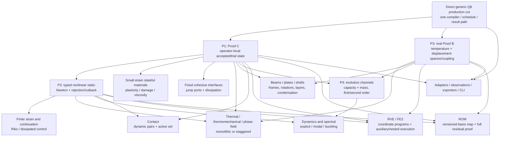

# R3-B — principled PyFEM v3 feature frontier after the generic production cut

## RESULT

**COMPLETE — recommend state before breadth.** After the direct generic Q8
production replacement is integrated and independently green, the highest-leverage
first feature is an executable **Proof C operator-local state transaction**. It
should use a real small-strain irreversible response under a prescribed path, with
one stateful and one stateless operator coexisting, before a generic Newton solver
is added. The next three packets are typed nonlinear static plus one incompatible
small-strain history schema, real Proof B thermal/thermoelastic spaces and coupling,
then distinct capacity/mass evolution channels.

This order is not the legacy class order. It establishes the state, space, channel,
and evolution axes on which the remaining v1 mathematics depends.

## Artifact identity and repository gate

- Repository: `/Users/sora/Projects/python/PyFEM`
- Required and observed exact base:
  `04baa4a79cbcddff888c57b239df5202e2b41424`
- Required short base: `04baa4a`
- Initial full porcelain: empty after disabling the repository's failing fsmonitor
  query (`git -c core.fsmonitor=false status --porcelain=v1 --untracked-files=all`)
- Final full porcelain: recorded again in the final gate below
- Repository mutations: none
- Canonical report SHA-256: `67992844160d09ccf9b3033004b8bb39d0d5b7a3372da4be308a62f998422376`

The canonical digest is defined as the SHA-256 of this file after replacing the
64 hexadecimal characters on the preceding digest line with the literal token
`<REPORT_SHA256>`. The callback/final response also gives the ordinary SHA-256 of
the complete stored file.

## Decision boundary

The direct production cut remains first. It must replace the frozen Q8 carrier,
compiler/program witnesses, Q8 recipe replay, and recursive internal validators
with one production path through entity blocks, discrete spaces, bound operator
blocks, typed channels, coordinate maps, explicit state/execution, and observations.
No feature writer should overlap that semantic replacement.

The accepted isolated proof at `099b51f` establishes three unlike stateless
operators and native-width incidence, but its current executable carrier still has
one `CompiledSystem.space`, one displacement space, `local_state_width == 0`, and
an assembly API that accepts only coefficients. Therefore neither real Proof B nor
Proof C is already production behavior.

## Why Proof C is first

The persistent dependency cut is not “which legacy family has the most files.” It
is which new semantic axis most constrains all later implementations.

Real operator-local accepted/trial state is prerequisite to:

- nonlinear static acceptance, line search, step rejection, cutback, and restart;
- plasticity, damage, viscosity, crystal plasticity, sintering, cohesive history,
  and phase-field irreversibility;
- formulation-owned history such as interface frames or condensed shell variables;
- continuation methods whose accepted evolution must match the committed local
  response;
- contact active-set history;
- nested FE2 micro checkpoints; and
- atomic staggered or multi-stage acceptance.

It also has an unusually strong independent proof. A prescribed strain path can
exercise load, damage/plastic advance, unload, reload, candidate repetition,
rejection, and acceptance without confounding the test with a global nonlinear
solver. This isolates the architecture's most consequential ownership law before
Newton is allowed to depend on it.

The legacy source confirms that this is a genuine semantic fault line rather than
an invented framework concern. `BaseMaterial` keeps mutable `oldHistory` and
`newHistory`; `MaterialManager` allocates history by a traversal cursor; and
`NonlinearSolver` mutates the global candidate in place before it knows whether the
step will converge, then commits element/model histories afterward. The generic
instance should preserve the mathematical history, not this ownership scheme.

## Dependency graph

The arrows mean semantic prerequisites, not that every downstream family must wait
for every upstream packet. For example, a linear beam can follow Proof B without
nonlinear state, and a solve-free VTK sink can follow stable observations. The
recommended sequence prioritizes contracts with the widest fan-out.

## Ranked comparison

Scores are 1–5. Higher is better. `safety` means lower risk of freezing a premature
abstraction; `tractability` means lower implementation cost. Weighted total is
`3*information + 3*unlock + 2*oracle + 2*safety + tractability` (maximum 55).
Counts are capability-family leverage, not evidence-grade upgrades.

| Rank | Candidate front | Information | Unlock | Oracle | Safety | Tractability | Weighted | Judgment |
|---:|---|---:|---:|---:|---:|---:|---:|---|
| 1 | Real operator-local state and transaction (Proof C) | 5 | 5 | 5 | 4 | 3 | **51** | First. It fixes the accepted/trial boundary used by nearly every nonlinear, irreversible, contact, FE2, and composite analysis. |
| 2 | Multiple spaces and coupling (real Proof B) | 5 | 4 | 5 | 4 | 4 | **49** | Second architectural axis, but the cut may carry representation-only signatures. Turn it into thermal/thermoelastic mathematics after state/transaction semantics are stable. |
| 3 | Dynamics, mass, capacity, and evolution | 5 | 4 | 5 | 3 | 2 | **45** | High information: distinguishes bilinear channels and first/second-order state. Depends on stable spaces and atomic evolution. |
| 4 | Thermal, coupled, and phase-field behavior | 4 | 4 | 4 | 4 | 3 | **43** | Thermal conduction is a strong Proof B vehicle; phase field must wait for both coupling and irreversible state. Do not port the family as one legacy element hierarchy. |
| 5 | Small-strain material-family breadth | 2 | 4 | 5 | 4 | 4 | **40** | Excellent mathematical oracles and useful behavior, but stateless constitutive breadth teaches little new architecture. Add state-schema-incompatible laws only after Proof C. |
| 6 | Beams, plates, shells, and sections | 4 | 5 | 3 | 2 | 1 | **38** | Large legacy reach, but frames, rotations, layers, mass, and condensation combine several axes. A broad port now would prematurely canonize a Section taxonomy. |
| 7 | Cohesive interfaces and contact | 5 | 3 | 4 | 2 | 2 | **38** | Split this legacy grouping: a fixed cohesive interface is an ordinary stateful operator and can follow Proof C; dynamic contact pairs and active sets come much later. |
| 8 | Adapters, results, exporters, CLI | 2 | 5 | 4 | 2 | 3 | **36** | Many visible rows, little new mathematics, and high compatibility-lock risk. Stable observations may be added narrowly; broad public compatibility follows vertical slices. |
| 9 | ROM | 4 | 2 | 4 | 2 | 2 | **32** | Reduced coordinates fit the IR, but durable basis identity, snapshot provenance, and full-residual verification need stable spaces/results first. |
| 10 | RVE and FE2 | 5 | 2 | 2 | 1 | 1 | **28** | Architecturally informative but expensive and weak as an early oracle. It needs explicit auxiliary execution, nested state, restart, and cost/provenance semantics. |

### Important rank qualifications

- A **fixed cohesive interface** should be separated from contact. After P1/P2 it
  is a good ordinary operator-family proof; dynamic contact is not.
- **Stateless** plane strain, isotropic 3D elasticity, and other small-strain laws
  can be added cheaply, but should ride inside a packet that proves a new schema or
  real public case rather than become the frontier by themselves.
- **Thermal conduction** is the recommended real Proof B instance. Phase-field is
  not; it combines multiple spaces, nonlinear coupling, irreversibility, and
  staggered acceptance, obscuring which boundary failed.
- **Shells** provide strong objectivity and mass tests but weak literal global
  oracles in the current test corpus. They become valuable after spaces, state,
  and mass channels are no longer provisional.

## Recommended four-packet sequence

All path lists are likely ownership sets to refreeze against the integrated
production cut. They are not authority to edit the current repository. Every
packet is serial with the preceding packet at the semantic integration boundary.

### P1 — executable Proof C: one real stateful operator transaction

**Outcome.** Extend the bound evaluator contract from
`(payload, ports) -> channels` to the semantic equivalent of
`(payload, ports, accepted_local_state, request) -> channels + trial_local_state`.
Compile one small-strain plane-strain damage response with scalar irreversible
`kappa`, beside a stateless elastic operator with an incompatible zero-width state
schema. Drive it through a prescribed displacement/strain program so the packet
does not yet own Newton.

This is a component slice of `STATE-LAYOUT`, `STATE-TRIAL`,
`STATE-TRANSACTION`, `STATE-GLOBAL`, `MAT-DAMAGE`, `ASM-INTERNAL`, and
accepted-state observation. It is not row-wide material parity.

**Likely owned production paths.**

- `pyfem/v3/model/operator.py`
- `pyfem/v3/model/state.py`
- `pyfem/v3/compile/continuum.py`
- new `pyfem/v3/materials/plane_strain_damage.py` (numeric response component;
  not a core Material class)
- `pyfem/v3/assembly/contracts.py`
- `pyfem/v3/assembly/reference.py`
- `pyfem/v3/analysis/contracts.py`
- the generic transaction owner produced by the cut (expected
  `pyfem/v3/analysis/linear.py` until a neutral owner is extracted)
- `pyfem/v3/results/contracts.py`
- `pyfem/v3/results/verification.py`
- new `test/v3/test_v3_generic_operator_state.py`
- new `test/v3/test_v3_plane_strain_damage.py`

**Acceptance examples.**

1. Exact elastic/damaging/unloading/reloading material-point values, including
   monotone `kappa` and bounded `0 <= damage <= 1`.
2. Directional finite differences match the advertised consistent tangent away
   from the initiation/completion corners.
3. Evaluating candidate B twice from accepted A gives bitwise-identical response
   and trial state; evaluating A then B gives the same B as B directly.
4. Rejected candidate, failed evaluation, abandoned transaction, and sibling trial
   leave accepted coefficients, evolution, and every local-state byte unchanged.
5. Acceptance commits exactly the trial tied to the accepted coefficients and one
   successor generation; double/sibling acceptance fails closed.
6. Reversing block order does not move state between stable entity/integration IDs.
7. `observe_committed` reconstructs stress/damage without changing state or
   generation.
8. Analysis/results contain no damage/material/type-name branch.

**Intentional difference from v1.** The legacy
`PlaneStrainDamage.getEquivStrain` computes `detadstrain` but returns the untouched
zero array `depsdstrain`; v3 should return and verify the consistent derivative.
Literal reproduction of that tangent defect is forbidden.

### P2 — typed nonlinear static plus one incompatible small-strain history schema

**Outcome.** Add a typed `NonlinearStatic` analysis consuming residual and
Jacobian channels only. It owns Newton iteration, line-search rejection, cutback,
and schedule/evolution coordinates while reusing P1's transaction. Add an
isotropic-hardening J2 response component with a state schema incompatible with
the scalar damage law (stress/plastic strain/equivalent plastic strain), so state
layout is not accidentally specialized to one scalar history.

This advances component slices of `ANAL-NONLINEAR`, `PROG-SCHEDULE`,
`STATE-EVOLUTION`, `ASM-TANGENT`, `MAT-PLASTIC-ISO`, and `MAT-DISPATCH` without
creating a runtime material registry or solver switch.

**Likely owned production paths.**

- new `pyfem/v3/analysis/nonlinear.py`
- `pyfem/v3/analysis/contracts.py`, `analysis/__init__.py`
- new `pyfem/v3/materials/j2_isotropic.py`
- `pyfem/v3/compile/continuum.py`
- `pyfem/v3/model/operator.py`, `model/state.py`, `model/program.py`
- `pyfem/v3/assembly/contracts.py`, `assembly/reference.py`
- `pyfem/v3/results/contracts.py`, `results/verification.py`, `results/solution.py`
- `pyfem/v3/api.py`
- new `test/v3/test_v3_generic_nonlinear.py`
- new `test/v3/test_v3_j2_isotropic.py`

**Acceptance examples.**

1. Closed-form one-dimensional elastic/yield/plastic/unload/reload specialization
   of the J2 update and a 3D hydrostatic/deviatoric invariance matrix.
2. Algorithmic tangent passes a directional derivative away from the yield corner;
   the unperturbed trial state survives numerical-tangent checks.
3. A one-DOF nonlinear equilibrium with independently known root verifies residual,
   tangent, iteration trace, and full balance.
4. A forced rejected line search and a forced step cutback leave the committed
   generation byte-for-byte unchanged, then a retry commits once.
5. Nonzero affine prescribed offsets remain satisfied in every candidate and the
   accepted result.
6. Stateful damage, stateful plasticity, and stateless elasticity coexist without
   analysis dispatch on response-law identity.
7. Checkpoint/rebind may remain a separately frozen follow-up unless a persistence
   decoder already exists; no ad hoc pickle is introduced.

**Intentional difference from v1.** Do not copy `MaterialManager`'s evaluation
cursor, per-point Python objects, mutable output bags, debugging prints, or
numerical-tangent state restoration. Do not copy `NonlinearSolver`'s in-place
candidate mutation or its post-convergence increment reset. Preserve constitutive
intent and independently checked mathematics.

### P3 — real Proof B: thermal and thermoelastic operator ports

**Outcome.** Make the production system genuinely multi-space: a scalar
temperature space and a displacement space with independent semantic coefficient
IDs, active-support maps, and nonstandard component ordering. Add a Q4 thermal
conduction operator, a Robin boundary operator, and a small-strain thermoelastic
operator whose displacement residual depends on temperature. Cross-space Jacobian
channels name source and target ports explicitly. A nonsymmetric global operator
must remain nonsymmetric; backend choice may use capability metadata, never an
operator/type-name branch.

This advances component slices of `FORM-THERMAL`, `FORM-THERMAL-BC`,
`FORM-THERMOMECH`, `COMP-DOF`, `PROG-DISTRIBUTED-LOAD`, and Proof B. Phase-field
and transient capacity remain out of this packet.

**Likely owned production paths.**

- `pyfem/v3/model/system.py`, `model/operator.py`
- `pyfem/v3/compile/system.py`
- new `pyfem/v3/compile/thermal.py`
- `pyfem/v3/compile/continuum.py`
- `pyfem/v3/model/program.py`, `compile/program.py`
- `pyfem/v3/assembly/contracts.py`, `assembly/prepare.py`, `assembly/reference.py`
- `pyfem/v3/analysis/contracts.py`, `analysis/linear.py`
- `pyfem/v3/numerics.py`
- `pyfem/v3/results/contracts.py`, `results/verification.py`
- new `test/v3/test_v3_generic_spaces.py`
- new `test/v3/test_v3_thermal_operator.py`
- new `test/v3/test_v3_thermoelastic_operator.py`

**Acceptance examples.**

1. Mechanical-only, thermal-only, and coupled systems allocate exactly their
   active entity-space coefficients; no ghost displacement or temperature DOFs.
2. Nonstandard component and space order preserves the same source-remapped result.
3. A one-cell conduction problem has an exact affine temperature field, exact
   boundary heat balance, and exact constant flux observation.
4. Robin and prescribed flux contributions add and retain attribution.
5. The thermoelastic off-diagonal `d r_u / d T` passes finite differences and is
   assembled at the declared target/source spaces.
6. The assembled coupled Jacobian is not silently symmetrized; a general linear
   reference solve agrees with an independent dense block solve.
7. Adding temperature changes no `CompiledSystem`, result, or analysis field whose
   meaning is a concrete legacy element/material name.

**Intentional difference from v1.** Do not reproduce hard-coded `splitDofIDs` or
embed `C/dt` and theta integration inside the thermal element tangent. Thermal
capacity is a separate channel owned by P4.

### P4 — distinct capacity/mass channels and typed evolution

**Outcome.** Add first-order capacity and second-order mass as separate bilinear
channels, then bind them through request-owned evolution layouts. Prove one scalar
thermal decay problem and one one-DOF mechanical oscillator (or equivalent tiny
bar/spring-mass system) through typed first- and second-order analyses. The point is
not solver breadth; it is to make evolution order, derivatives, balance, restart,
and accepted transition semantics explicit before large dynamics or shells.

This advances component slices of `ASM-MASS`, `STATE-EVOLUTION`, `ANAL-EXPLICIT`
and/or an implicit transient request, and the transient part of `FORM-THERMAL`.
Modal/buckling breadth remains a subsequent packet.

**Likely owned production paths.**

- `pyfem/v3/model/operator.py`, `model/state.py`
- `pyfem/v3/assembly/contracts.py`, `assembly/prepare.py`, `assembly/reference.py`
- new `pyfem/v3/analysis/evolution.py`
- `pyfem/v3/analysis/contracts.py`, `analysis/__init__.py`
- `pyfem/v3/results/contracts.py`, `results/verification.py`, `results/solution.py`
- `pyfem/v3/api.py`
- new `test/v3/test_v3_capacity_evolution.py`
- new `test/v3/test_v3_mass_evolution.py`

**Acceptance examples.**

1. Exact one-DOF `C Tdot + K T = 0` step amplification for the chosen theta rule,
   including source/capacity/conduction balance and restart equality.
2. Exact one-DOF oscillator frequency and one-step update for the chosen
   second-order method, with kinetic/potential energy evidence where appropriate.
3. Prescribed field derivatives obey the coordinate map; algebraic fields receive
   no invented velocity/acceleration storage.
4. Mass and capacity remain attributable channels and are not folded permanently
   into a generic stiffness.
5. Rejected/cutback evolution commits neither field derivatives nor operator-local
   state; accepted mixed state advances atomically.
6. A later modal request can consume the named mass/stiffness channels without
   importing a beam/shell/operator type.

## What follows, but not in these packets

After P1–P4, the next family should be chosen by application need:

- fixed cohesive interface plus dissipated functional is the cleanest next
  stateful new-incidence proof;
- finite strain and Riks can then reuse nonlinear transactions and attributed
  material/geometric/load tangents;
- beams should enter one formulation at a time through explicit displacement/
  rotation ports and frame payloads; plate/shell/laminate/condensation breadth waits
  for those laws plus mass channels;
- phase field waits for P1 state, P2 nonlinear acceptance, and P3 coupling;
- contact waits for a separately frozen dynamic/over-allocated topology policy;
- RVE stress observation can arrive before FE2, but RVE tangents must be explicit
  auxiliary execution, never a passive observation or commit hook;
- FE2 waits for nested checkpoints, restore, cost accounting, and verification;
- ROM waits for stable space/result identity and a versioned basis-coordinate-map
  artifact with full residual verification; and
- adapters/exporters/CLI follow stable vertical slices and explicit compatibility
  decisions.

## Capabilities intentionally changed or retired

These are architecture recommendations, not authorization to delete public
behavior before adjudication.

### Change rather than literal match

- Legacy Element/Material/Section/Model/Solver class decomposition becomes authored
  helpers, typed payload components, operator evaluators, analysis policies, or
  observation sinks.
- Mutable history dictionaries and traversal-order material cursors become compact
  operator-local accepted/trial arrays keyed by stable semantic IDs.
- `eval`-based load/time expressions become typed signals, schedules, and bounded
  adapter syntax.
- Thermal time integration embedded in an element tangent becomes separate
  conduction, capacity, source, and evolution responsibilities.
- Hard-coded coupled DOF splitting becomes discrete-space port/gather maps.
- Contact's scan of every node and global penalty action becomes an interaction
  entity block with declared fixed/over-allocated/dynamic/matrix-free topology and
  active-set state.
- RVE homogenized stress is a solve-free observation; RVE tangent unit-strain solves
  are explicit auxiliary executions from a named accepted generation.
- FE2 is a nested operator evaluator with trial micro checkpoints, not a Material
  object that owns solvers and writers.
- ROM snapshots/bases become versioned artifacts and coordinate maps with model,
  space, inner-product, and implementation compatibility.
- Text/VTK/HDF5/graph outputs consume typed observations and provenance; their
  legacy mutable `GlobalData` access and exact file layouts are not core semantics.

### Retire after replacement proof or explicit public decision

- `V3-PROTOTYPE-CARRIER`, `V3-PROTOTYPE-REGISTRY`,
  `V3-PROTOTYPE-ASSEMBLY`, and `V3-PROTOTYPE-ANALYSIS` after their unique
  numerical oracles migrate.
- Duplicate `ANAL-MODAL-DUP` after one spectral contract is chosen.
- `ROM-LINEAR-MANIFOLD` and `ROM-QUADRATIC-MANIFOLD`: they are unimplemented
  placeholders, not behavior to reproduce.
- Arbitrary legacy pickle input/result graphs in favor of versioned restore/result
  artifacts; public retirement still requires explicit approval.
- Mutable root `NodeSet`/`ElementSet`, exact `PyFEMAPI`, GUI, and archive support are
  public-decision candidates, not silently deleted by a numerical packet.

## Explicit non-goals

- No feature implementation before the production cut is integrated and green.
- No legacy class-by-class port and no new core Element/Material/Section/Model kinds.
- No solver or result branch on topology, formulation, material, section, or legacy
  type-name strings.
- No broad `.pro`/`.dat`, CLI, GUI, exporter, or root-API compatibility in P1–P4.
- No feature-parity claim from inventory rows, source existence, or a single legacy
  final displacement.
- No contact, FE2, ROM, shell, phase-field, or continuation implementation hidden
  inside a foundational packet.
- No performance backend specialization before representative stateful/coupled
  public flows exist.
- No recursive downstream validation of trusted compiler-owned carriers; restore
  decoding remains its own authority boundary.
- No preservation of known legacy defects merely to obtain literal parity.

## Parallelism decision

**No feature implementation should proceed in parallel with the generic spine
replacement.** The cut and P1–P4 all compete for the semantic meaning and likely
ownership of `model/system.py`, `model/operator.py`, `model/state.py`,
`compile/system.py`, `assembly/contracts.py`, `assembly/prepare.py`,
`assembly/reference.py`, analysis contracts, and result verification. Parallel
writers would freeze incompatible evaluator/state/space/channel contracts or force
an adapter between them.

Safe parallel work is read-only only: derive independent material-point curves,
thermal element matrices, one-DOF evolution solutions, or classify legacy examples
without proposing production carriers. Those reports must be adjudicated after the
cut; they do not authorize an implementation branch.

## Smallest next action

I0 should **not dispatch a feature writer**. First adjudicate the refreshed
production-cut report, the implementation-parity audit, and this frontier report;
freeze one sole-writer direct generic Q8 replacement at exact clean current base;
integrate and independently prove its numerical/balance, transaction, trust-boundary,
deletion, and clean-tree gates. Only then refreeze P1 above against the actual new
operator/state ABI.

The smallest useful preparation for P1 is a read-only two-page oracle card defining
the scalar damage law, exact load/unload/reload points, the tangent differentiability
regions, and the bytewise candidate/reject/accept matrix. It must not define another
carrier or edit source.

## Evidence anchors

- The 154-row E0 inventory accounts for 52 preserve, 89 change, and 13 retire
  dispositions; all remain source-level leads unless later evidence upgrades a
  bounded component slice.
- The R2-E instance map classifies 95 direct, 56 composed, two questionable
  (`MODEL-RVE-HOMOG`, `ROM-POD`), and one not representable
  (`V3-PROTOTYPE-CARRIER`), with no seventh numerical concept required.
- The isolated generic proof has Q4 continuum, T3 continuum, directional spring,
  program-owned point loads, exact attributed assembly/balance, and zero local
  state; it is not a production multi-space or nonlinear feature path.
- The frozen Phase 1 path supplies strong Q8 numerical, affine constraint, balance,
  transaction, and fresh-verification oracles, while the direct production cut is
  intended to remove its Q8 carrier/replay/recursive-validation structure.
- Legacy `PlaneStrainDamage.py:82-133` demonstrates a derivative-return defect;
  `ThermoSmallStrainContinuum.py:48-106` folds capacity/time integration into the
  element tangent and uses hard-coded local DOF splits; `NonlinearSolver.py:54-125`
  mutates candidate state before convergence and resets the increment after commit;
  `Contact.py:53-75` scans global nodes and assembles through model action state.

## Final repository gate

- `git rev-parse HEAD`:
  `04baa4a79cbcddff888c57b239df5202e2b41424`
- `git -c core.fsmonitor=false status --porcelain=v1 --untracked-files=all`:
  empty
- Repository remained exact and clean; only this `/private/tmp` report was written.
