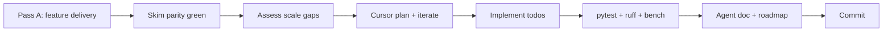

# Phase hardening (pass B)

**Pass A** ([WORKFLOW.md](WORKFLOW.md)): deliver a roadmap checkbox with skim parity on book-scale examples.

**Pass B** (this doc): make that work credible at the **next scale**—larger meshes, higher DOF count, repeated solves, or memory pressure—without changing the parity contract unless the plan says so.

Branch: `v3`. Legacy `pyfem/` on `main` is out of scope unless the hardening plan says otherwise.

**Reference:** P1 scale hardening — [scaling.md](scaling.md), `pyfem/v3/mesh/refined_patch.py`, `test/v3/_bench_solve_scale.py`.

## Quick start

| You want to… | Say |
|--------------|-----|
| Open a hardening pass | `Harden [phase/item] per .agents/v3/hardening.md — plan only, no implementation yet.` |
| Iterate the Cursor plan | `Refine the hardening plan in Cursor.` |
| Execute | `Implement the hardening plan (attached). Do NOT edit the plan file.` |
| Close out | `Any refactoring still pending? If so, do it, then stage and commit.` |

Full prompts: [Prompt library](#prompt-library) below.

## When to harden (and when not to)

**Harden when** skim parity is green but one or more signals apply:

| Signal | P1 example |
|--------|------------|
| Scale untested | `patch_test8` (5 elems) passes; uniform Q8 grids never run |
| Performance unknown | No staged bench; tiny-mesh timings would mislead |
| No programmatic fixtures | Only book `.dat` skims; no generator for sweep meshes |
| Hot path not ready | Staged element kernel; monolithic COO buffer at large `n_elems` |
| Repeat work expensive | Full assemble + `spsolve` every RHS; no factorization reuse |

**Do not harden when:**

- The roadmap checkbox or skim parity is not done yet.
- The gap is a **missing feature** (new element, BC type, material)—that is pass A, not pass B.
- You only need docs or a one-line fix; skip the full hardening loop.

## Two-pass model



### Pass B steps (agent)

1. **Assess** — [feature-parity.md](feature-parity.md) row, legacy behavior, bottlenecks (assembly, solve, memory).
2. **Plan** — write `.cursor/plans/p<n>_<topic>_hardening.plan.md` in Cursor (not chat-only).
3. **Iterate** — review todo order, API stability, bench honesty; refine plan before coding.
4. **Implement** — todos in dependency order; on failure, find root cause (fixture bugs often surface in benches, not in parity tests).
5. **Verify** — pytest, ruff, and any `test/v3/_bench_*.py` from the plan.
6. **Document** — e.g. `.agents/v3/<topic>.md` with methodology and **sample numbers** from a real bench run.
7. **Finish** — minor refactors only if needed; stage and commit.

**Plan file rule:** do not edit the Cursor plan during implementation.

## Cursor plan template

Each hardening plan should contain:

| Section | Content |
|---------|---------|
| Overview | One sentence: why harden now |
| Status | Done vs blocked (table) |
| Todos | Ordered list with ids — e.g. fixture → bench → kernel → assembly → context → docs |
| Out of scope | Explicit deferrals (other elements, public API changes, …) |
| Verification | Commands matching CI (see [Verification](#verification)) |
| Commit | One or a few logical commits; message shape per root `AGENTS.md` |

**Typical todo order (adapt per phase):**

1. Programmatic mesh or fixture generator + unit tests  
2. Bench script (`test/v3/_bench_*.py`, **not** pytest-collected)  
3. Hot-path change (kernel, assembly chunking, …)  
4. Solver reuse / state context (if repeat solves matter)  
5. Agent doc + roadmap / architecture / conventions updates  

## Deliverables

| Artifact | Role |
|----------|------|
| Fixture generator | Scale sweeps without hand-built `.dat` files |
| `test/v3/_bench_*.py` | Staged timings; local R&D, not CI pytest |
| Equality test (small mesh) | Optimized path matches reference |
| Internal experimental API | e.g. `LinearSolutionContext` — keep `solve_linear` unchanged unless plan allows |
| Agent topic doc | How to run benches; sample numbers; do not extrapolate from skims |
| Roadmap checkbox | Mark hardening done; link topic doc from [architecture.md](architecture.md) |

## Bench design

Good benches are **diagnostic**, not marketing.

- **Two tiers:** (1) grid or scale sweep for assembly/solve cost; (2) small loaded skim to validate reuse paths (e.g. factorized repeat solve).
- **Honest columns:** one solver context per row; do not factorize twice in the same timing loop; document what each column includes.
- **Skip degenerate cases:** e.g. 1×1 Q8 with zero interior DOFs.
- **Root-cause first:** P1 bench failure was orphaned mesh nodes (singular `K`), not SciPy — parity tests did not catch it.

See [scaling.md](scaling.md) for column definitions and sample output.

## Verification

```bash
uv sync --group v3
uv run pytest test/v3 -q
uv run ruff check pyfem/v3 test/v3 --config pyfem/v3/ruff.toml
uv run python test/v3/_bench_<topic>.py   # when the plan adds one
```

**Exit criteria:**

- Parity tests still green.
- Bench completes through the planned sizes (or stops cleanly on `MemoryError`).
- Topic doc includes sample numbers from the run you actually executed.
- Pytest count ≥ count before hardening (new tests expected).

## Hardening checklist

- [ ] Pass A done: skim parity + roadmap checkbox (or hardening is its own checkbox)
- [ ] Cursor plan written and approved before implementation
- [ ] Programmatic large-case generator + unit tests
- [ ] `_bench_*.py` with staged timings
- [ ] Small-mesh equality: optimized vs reference path
- [ ] Agent doc with methodology and sample numbers
- [ ] [roadmap.md](roadmap.md), [architecture.md](architecture.md), [conventions.md](conventions.md) updated as needed
- [ ] Commit excludes `.vscode/settings.json` and `notebooks/v3/*` unless requested

## Hard constraints (same as pass A)

- Python 3.13+; 2-space Ruff via `pyfem/v3/ruff.toml`
- Array-only `ProblemDefinition`; no `eval` in I/O
- Numba rules in root `AGENTS.md` (gitignored locally)
- Do not loosen `parity.toml` without a note in [parity.md](parity.md)
- Prefer book `.dat` via skim layer A for parity; use generators for **scale**, not for replacing parity skims

## Prompt library

### 1. Start (plan only)

```text
Harden [phase/item] per .agents/v3/hardening.md — plan only, no implementation yet.

Assess gaps vs .agents/v3/feature-parity.md. Draft
.cursor/plans/p[n]_[topic]_hardening.plan.md with ordered todos.
```

### 2. Iterate plan

```text
Refine the hardening plan in Cursor. [Optional: your feedback]
Do NOT edit the plan file during implementation.
```

### 3. Implement

```text
Implement the hardening plan as specified (attached). Do NOT edit the plan file.
Mark todos in progress/completed. Don't stop until all todos are done.
```

### 4. Finish and commit

```text
Any refactoring still pending at this stage? If so, do it, then stage and commit.
Do not edit the plan file. Exclude .vscode/settings.json and notebooks/v3/*.
```

### 5. Full session override

Use when you want the whole pass B in one brief:

```text
PyFEM v3 — branch `v3`.

Phase [Pn] feature [X] has skim parity. Harden it for [goal] per .agents/v3/hardening.md.

1. Assess gaps (feature-parity, legacy, bottlenecks).
2. Draft .cursor/plans/p[n]_[topic]_hardening.plan.md — iterate until I approve; no code yet.
3. Implement plan; verify pytest + ruff + bench; update .agents/v3/<topic>.md with sample numbers.
4. Minor refactors if needed; stage and commit (exclude .vscode, notebooks/v3).

Constraints: WORKFLOW.md, root AGENTS.md Numba rules. Keep solve_linear / parity path unchanged unless plan allows.
Out of scope: [list].
```

## Phase hints (swap deliverables, keep workflow)

| Phase | Hardening focus | Likely todos |
|-------|-----------------|--------------|
| P1 (done) | 2D Q8 scale, linear solve | Uniform patch mesh, fused kernel, chunked COO, `LinearSolutionContext`, [scaling.md](scaling.md) |
| P2 (plane strain done) | Plane strain at Q8 scale | `build_uniform_q8_loaded`, `_bench_plane_strain_scale.py`, [plane_strain.md](plane_strain.md) |
| P2 (remaining) | 3D continuum, plane strain | Hex/tet generator, 3D DOF map, assembly scatter at scale, `PatchTest8_3D` skim stays parity |
| P3+ | Nonlinear repeat solves | `SolverState`, tangent reuse, Newton loop bench, load-step context |

## Lessons from P1

| Observation | Takeaway |
|-------------|----------|
| Bench failed; parity passed | Add scale fixtures and benches; skims alone are insufficient |
| Singular `K` on uniform patch | Root cause was mesh topology (orphan nodes), not the solver |
| Todo order mattered | fixture → bench → kernel → assembly → context → docs |
| Public API | Experimental context OK; `solve_linear` left unchanged |
| Commit | Feature + hardening can ship together when same phase |

## Related docs

- [WORKFLOW.md](WORKFLOW.md) — pass A feature delivery
- [scaling.md](scaling.md) — P1 benchmark notes and sample table
- [roadmap.md](roadmap.md) — phase checkboxes
- [feature-parity.md](feature-parity.md) — capability matrix
- [parity.md](parity.md) — skim layers and regression discipline
- [architecture.md](architecture.md) — component map
